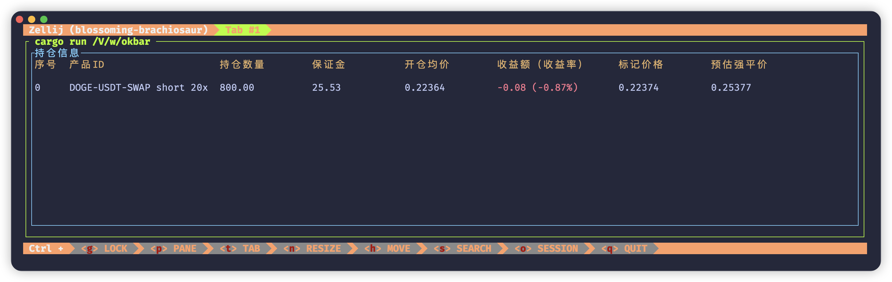
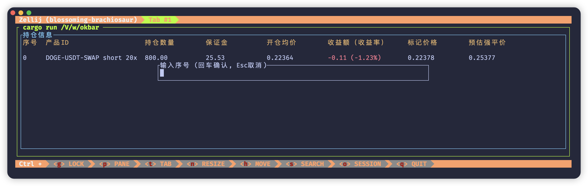
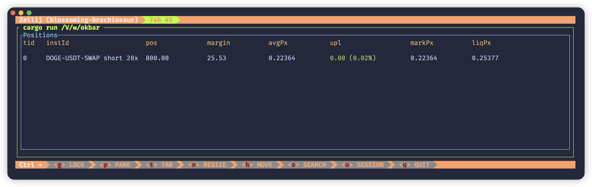
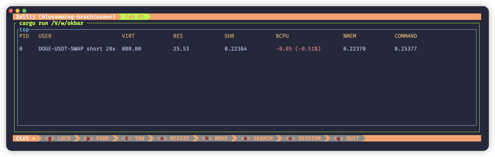
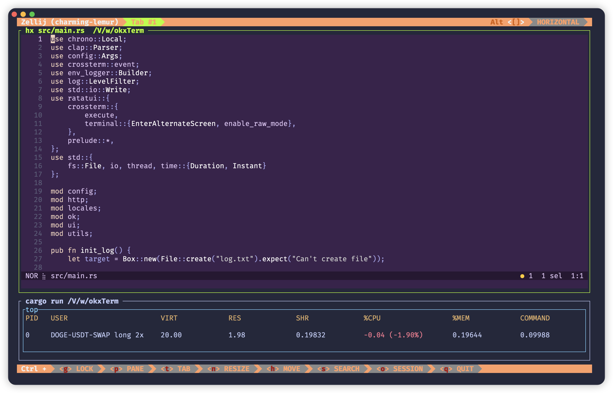

# okxTerm


okxTerm 是一个面向 okx 交易所的非官方终端程序，基于 v5 API 实现，主要用来在终端中查看持仓信息和一键平仓。okxTerm 源代码完全开放，使用 Rust 编写，跨平台。  

okxTerm 面向的用户群体是上班族，用 APP 开了合约，上班的时候又不方便盯盘，这个时候在终端打开 okxTerm，就可以非常方便跟踪持仓信息。 

### 使用

okxTerm 功能非常简单，目前仅支持查看永续合约持仓列表和按市场价平仓功能。okxTerm 原则上不提供发行版本，用户需要自己编译。

**编译**
```shell
# 安装 Rust
curl --proto '=https' --tlsv1.2 -sSf https://sh.rustup.rs | sh

# 克隆源代码
git clone https://github.com/okxterm/okxTerm.git
cd okxTerm

# 复制配置
cp config.toml.sample config.toml

# 编译
cargo build --release

# 运行
cargo run --release
```

### 多语言
#### 中文

**持仓信息**



**平仓**



#### 英文

**持仓信息**



#### fake

**持仓信息**




#### tmux




你可以选择适合自己的界面。


### 配置文件
将 config.toml.sample 文件名修改为 config.toml
```toml
lang = "fake"

[okx]
api_key = "your api key"
secret_key = "your secret key"
passphrase = "your passphrase"
```

lang 支持 zh、en、fake，如果需要更多，按 locales 目录下的文件自定义即可。

okx 就是 okx 交易所的 api key。如果需要平仓功能，就需要开通交易权限，否则只读权限即可。

### 快捷键
#### 列表界面
Esc 隐藏界面，老板键
q 退出界面
c 打开平仓界面

#### 平仓界面
Esc 关闭平仓界面
Enter 确认平仓

### 使用协议
okxTerm 只是调用了 okx 接口在终端显示持仓信息，你的盈利、亏损都与 okxTerm 无关。只要打开了 okxTerm 即表示默认遵守该协议。


### 交流讨论
如果有技术层面的讨论交流可以在 issues 或者 discussions 提出来，同时也欢迎技术大咖提 pr。

[反馈](https://github.com/okxterm/okxTerm/issues)  

[讨论](https://github.com/okxterm/okxTerm/discussions)


### 捐赠
市场无情，人有情。如果你也喜欢本项目，可以请作者喝咖啡吗？

Solana: `3z4z2igZ17azTLnWK8CoAs4Y8Yr4zLXW8kWGcVBZtxse`

Ethereum: `0x27c75F7C4F66e549a2d8c8267FDe4C599299F812`

Sui: `0x72ed138ad13a33d23a60441935538f501a8dd00e69b31cd779ce5237d7d4e13e`

Bitcoin: `bc1qe6k75n5jvd3zpncgdeqz40w54nr52ehlk9385v`
